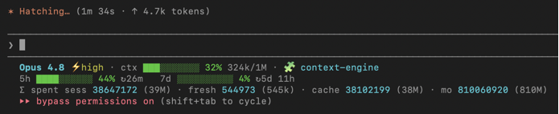

# cc-usage

A Claude Code status line that shows, at a glance and in real time:

- **Model & reasoning effort** — model name with a `⚡`-tagged effort indicator (`low`/`medium`/`high`/`xhigh`/`max`), color-scaled by intensity
- **Context window usage** — progress bar, percentage, and `used/size` tokens (auto-detects 1M context)
- **5-hour usage** — percentage with a reset countdown
- **Weekly (7-day) usage** — percentage with a reset countdown
- **Token spend** — this session and the current calendar month, split into **fresh** (billed: input + output + cache writes) and **cache** (cache reads); the session total is shown as exact digits for your own calculations
- **Rate-limit alert** — a red `⛔ … resets in 1h 28m` banner the moment a window is exhausted, kept live by a timed refresh even while the session is blocked

Cross-platform: macOS, Windows, and Linux. Pure Node.js, zero dependencies.



```
Opus ⚡high · ctx ██████░░░░ 63% 126k/200k
5h █████░░░░░ 47% ↻1h 0m   7d ██████░░░░ 58% ↻2d 7h
Σ spent sess 13203432 (13M) · fresh 1493210 (1.5M) · cache 11710222 (12M) · mo 782618983 (783M)

Opus ⚡max · ctx █████████░ 91% 910k/1M
⛔ 5h 100% · resets 1h 28m   ⛔ 7d 96% · resets 1d 4h
Σ spent sess 18500000 (18M) · fresh 2880000 (2.9M) · cache 15620000 (16M) · mo 1350000000 (1.4B)
```

## Requirements

- **Node.js** on `PATH` (`node --version`)
- **Claude Code v2.1.80 or later** — the 5-hour / weekly `rate_limits` data is provided to status lines starting with this version
- A **Claude.ai Pro or Max** subscription for the 5-hour and weekly segments. The `rate_limits` data is subscriber-only and appears after the first message of a session. Without it, the context segment still works and the usage line is hidden.

## How it works

Claude Code pipes session JSON to the status line command on stdin. cc-usage reads the official fields — no API calls, no token scraping, no transcript parsing:

| Display | Source field |
| --- | --- |
| Effort indicator | `effort.level` |
| Context % / bar | `context_window.used_percentage` (falls back to `current_usage`) |
| Context tokens | `context_window.total_input_tokens` / `context_window.context_window_size` |
| 5-hour usage + reset | `rate_limits.five_hour.used_percentage` / `.resets_at` |
| Weekly usage + reset | `rate_limits.seven_day.used_percentage` / `.resets_at` |
| Session / month token spend | aggregated from transcript JSONL under `~/.claude/projects/` |
| Model | `model.display_name` |

Reset countdowns are computed from the `resets_at` Unix timestamp against the current time on every refresh, so the countdown stays accurate even when the session is rate-limited and idle.

**Token spend** is the one metric not in the stdin payload (since v2.1.132 the `context_window` token fields report current context, not cumulative spend). It is summed from the transcript JSONL files, the same source `ccusage` uses:

- Each entry's four usage fields are accumulated separately: `input_tokens`, `output_tokens`, `cache_creation_input_tokens`, `cache_read_input_tokens`.
- **fresh** = `input + output + cache_creation` (the tokens billed at full / cache-write rates). **cache** = `cache_read` (billed at the discounted cache-read rate). **total** = fresh + cache.
- Entries are de-duplicated by `message.id` + `requestId`, because transcripts log the same message on multiple lines.
- **Session** sums the current transcript; **month** sums every transcript under `~/.claude/projects/` with an entry timestamped on or after the 1st of the current month (local time).
- Token figures are rendered as **exact digits with an abbreviation in brackets** (e.g. `13203432 (13M)`) so you can copy the precise value while still reading the magnitude at a glance. Set `exactTokens: false` to show only the abbreviation.
- Results are cached under `~/.claude/cc-usage/cache/` — the session total is recomputed only when its transcript changes, and the month total at most every 30 seconds with per-file incremental re-reads — so the status line stays fast even with hundreds of transcripts.

## Install

### As a plugin (recommended)

In Claude Code, add the marketplace and install the plugin:

```
/plugin marketplace add mikahoy045/CC-helper
/plugin install cc-usage@cc-helper
```

Then activate the status line (a plugin cannot register the main status line on its own — this writes it into your settings):

```
/cc-usage:setup
```

### Manually (from a clone)

```bash
git clone https://github.com/mikahoy045/CC-helper.git
node CC-helper/scripts/install.mjs
```

Both paths copy the renderer to a stable location (`~/.claude/cc-usage/`) and add a `statusLine` entry to `~/.claude/settings.json` pointing at it. Your other settings are preserved, and an existing third-party status line is never overwritten without `--force`.

## Commands

| Command | Action |
| --- | --- |
| `/cc-usage:setup` | Install / activate the status line |
| `/cc-usage:preview` | Render sample scenarios so you can see the styling |
| `/cc-usage:uninstall` | Remove it (restores any previous status line) |

## Configuration

Edit `~/.claude/cc-usage/config.json` (created on install). All fields are optional.

| Key | Default | Meaning |
| --- | --- | --- |
| `style` | `"blocks"` | Bar glyphs: `blocks` (`█░`), `shade` (`▓░`), `pipes` (`\| `), `ascii` (`#-`) |
| `barWidth` | `10` | Bar length in characters (1–40) |
| `color` | `true` | ANSI colors on/off |
| `multiLine` | `true` | Two lines (context, then usage) vs one combined line |
| `showModel` | `true` | Show the model name |
| `showEffort` | `true` | Show the `⚡` reasoning-effort indicator |
| `showContext` | `true` | Show the context segment |
| `showFiveHour` | `true` | Show the 5-hour segment |
| `showSevenDay` | `true` | Show the weekly segment |
| `showSessionTokens` | `true` | Show this session's token spend |
| `showMonthTokens` | `true` | Show this month's token spend |
| `tokenBreakdown` | `true` | Split the session into `fresh` (billed) and `cache` (cache reads) |
| `exactTokens` | `true` | Show exact digits instead of `k`/`M`/`B` abbreviations |
| `showCost` | `false` | Show estimated session cost |
| `warnPercent` | `70` | Yellow threshold |
| `critPercent` | `90` | Red threshold |
| `limitPercent` | `95` | At/above this, show the `⛔` rate-limit banner |
| `compactColumns` | `80` | Below this terminal width, drop bars and collapse to one line |

### Environment overrides

Useful for per-shell tweaks without editing the file: `NO_COLOR`, `CC_USAGE_NO_COLOR`, `CC_USAGE_STYLE`, `CC_USAGE_BAR_WIDTH`, `CC_USAGE_SINGLE_LINE`, `CC_USAGE_SHOW_COST`, `CC_USAGE_SHOW_EFFORT`, `CC_USAGE_SHOW_SESSION_TOKENS`, `CC_USAGE_SHOW_MONTH_TOKENS`, `CC_USAGE_TOKEN_BREAKDOWN`, `CC_USAGE_EXACT_TOKENS`, `CC_USAGE_CONFIG` (alternate config path), `CC_USAGE_REFRESH` (refresh interval seconds, install-time).

## Platform notes

- **Windows**: Claude Code runs the command through Git Bash or PowerShell. The installer writes the script path with forward slashes and `node`, which both shells accept.
- **Refresh**: installed with `refreshInterval: 10`, so countdowns tick while the session is idle or blocked. Change with `CC_USAGE_REFRESH=30 node scripts/install.mjs`.
- **Alternate config dir**: `CLAUDE_CONFIG_DIR` is respected throughout.

## Uninstall

```
/cc-usage:uninstall
```

or `node CC-helper/scripts/uninstall.mjs` from a clone. This removes the `statusLine` entry (restoring any previous one) and deletes the copied scripts. Your `config.json` is kept; pass `--keep-files` to also keep the scripts.

## Development

```bash
node --test          # run the unit tests
node scripts/preview.mjs   # see all scenarios
```

## Project layout

```
cc_helper/
├── .claude-plugin/
│   ├── plugin.json          # plugin manifest
│   └── marketplace.json     # single-plugin marketplace
├── statusline/
│   ├── cc-usage.mjs         # entrypoint: reads stdin, prints the status line
│   ├── render.mjs           # pure rendering (bars, colors, countdowns)
│   ├── tokens.mjs           # session/month token aggregation with caching
│   └── config.mjs           # config resolution (defaults + file + env)
├── scripts/
│   ├── install.mjs          # wire into settings.json (idempotent, atomic)
│   ├── uninstall.mjs        # remove and restore
│   └── preview.mjs          # sample-data demo
├── lib/
│   └── settings.mjs         # settings.json read / atomic write helpers
├── commands/                # /cc-usage:setup, :preview, :uninstall
└── test/
    └── render.test.mjs
```

## License

MIT with the [Commons Clause](LICENSE) condition.

- ✅ **Free to use by anyone, including in commercial projects and at companies.**
- ✅ Free to modify, fork, and redistribute at no charge.
- ❌ You may **not sell** the software or a fork of it, or charge for a product/service whose value derives mainly from this plugin's functionality.

See [LICENSE](LICENSE) for the full terms.
